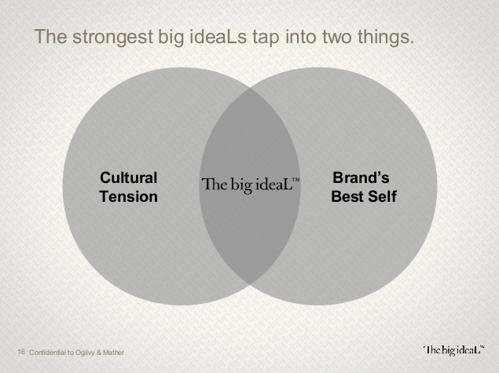

# Big Ideal

## ¿Qué es el Big Ideal?

El **big ideaL** es:

- una concepción de algo en su perfección
  - es una **misión social** o filosofía de empresa que **motiva desde dentro** a la marca y colaboradores

La L es la diferencia:
- Ideas = Share of mind
- Ideals = Share of culture 

Ayuda a establecer relaciones duraderas y provechosas con nuestros clientes y con el mercado. [^1]

## ¿Cómo se define?

Mediante la intersección de:

- **Cultural Tensions**
- **Best Brand Self**

"(**Poner nombre de la marca aquí**) cree que el mundo sería un lugar mejor si..." [^2]

[^1]: https://es.slideshare.net/ogilvywwplanning/whats-the-big-ideal
[^2]: https://www.slideshare.net/jorgeyunes/big-ideal